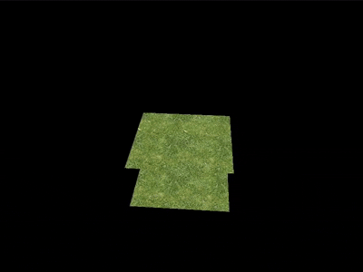

# FineNgine
A Vulkan and C++ based modern real time GPU based 3D rendering engine that I am building to better understand real-time rendering, Vulkan, and low-level programming.

## Compilation:
Run the makefile after installing the [dependencies](#dependencies). Also make sure to compile the shaders using the provided script [compileShaders.sh](https://github.com/findeevy/Finengine/blob/main/compileShaders.sh). I use [GCC](https://gcc.gnu.org/) and [Arch Linux](https://archlinux.org/) for compiling, the tools provided probably won't work on macOS or Windows out of the box but will most likely work on other Linux distributions.

## Current Features:
- 3D Model support (.obj).
- Blinn-Phong Lighting
- Fragment/vertex shader support.
- Colored lighting.
- Window resizing.
- Texture mapping.
- Multi-sampling (MSAA).
- Mipmaps (Level of detail scaling on textures).
- Depth buffer (Z-depth).
- Discrete graphics device selection.
- GPU/CPU memory management (staging buffer).
- Swap chain and frame buffer management.
- CPU/GPU synchronization.
- Error checking.

## Future Features:
- Better documentation (oops...)
- Shadow Mapping
- Compute Shaders
- CPU Multithreading for Initialization

## Sample Output:

## Dependencies:
- [Vulkan](https://www.vulkan.org)
- [GLM](https://github.com/g-truc/glm)
- [STB](https://github.com/nothings/stb)
- [GLFW](https://www.glfw.org)
- [TinyObjLoader](https://github.com/tinyobjloader/tinyobjloader)
